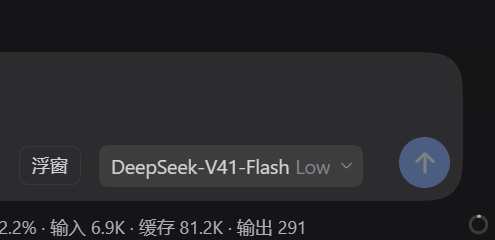
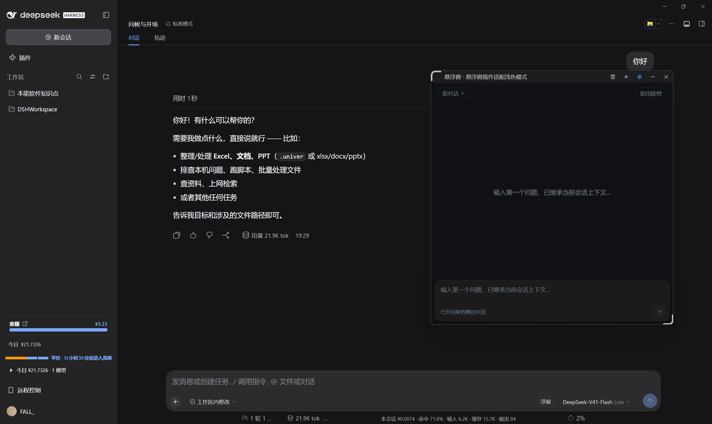
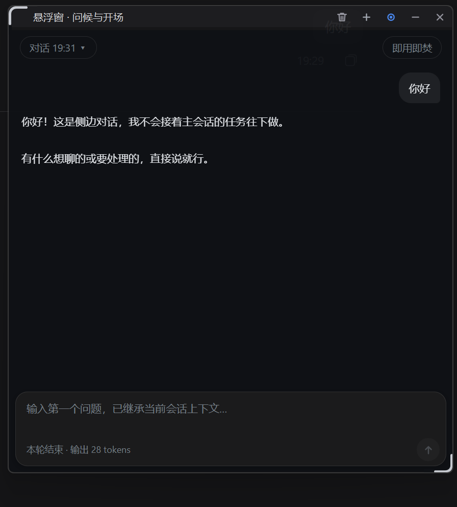
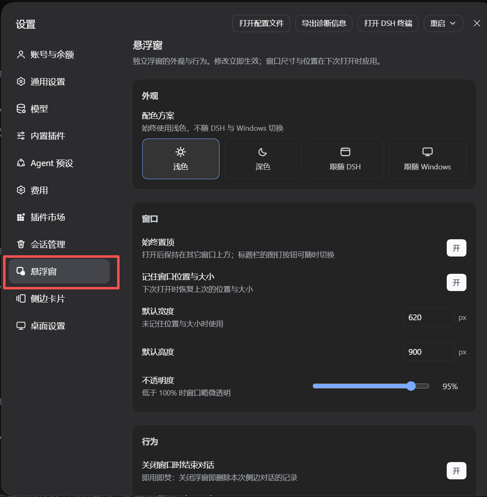
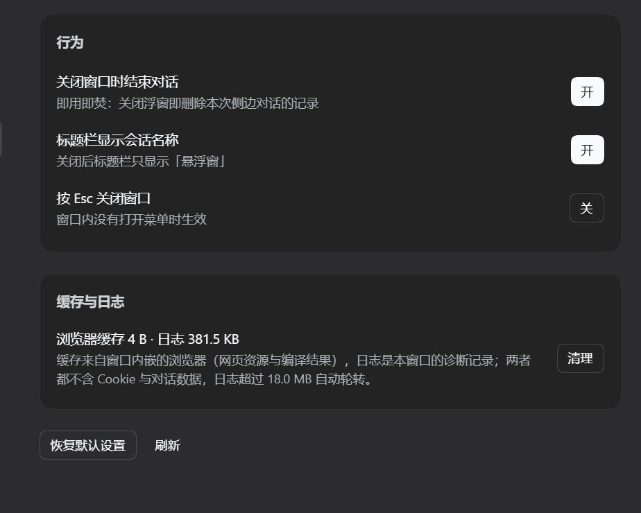

<div align="center">

# dsh-float-chat

**把 DSH 的侧边对话弹出来，变成一个能压在所有应用之上的独立置顶浮窗。**

宿主半边 + 浏览器半边 + 一个 WinForms / WebView2 原生窗口进程，三块拼成同一件事。


[简体中文](./README.md) · [English](./README.en.md) · [安装](#安装) · [使用](#使用) · [配置项](#配置项) · [FAQ](#faq)

</div>

---

## 项目简介

DSH 的侧边对话（side chat）只能待在 DSH 主窗口里。一旦你切到别的应用——浏览器、编辑器、终端——  
它就被压在后面了；而 DSH 主窗口最小化之后，它更是完全看不见。

`dsh-float-chat` 把这段对话独立出来，做成一个**无边框、可置顶、能覆盖在任何其他应用之上的悬浮窗**：

- 在输入框右侧点一下 **浮窗**，窗口就起来了，并**继承当前会话的上下文**；
- 窗口有自己的标题栏与开关（新对话 / 置顶 / 清理缓存 / 最小化 / 关闭）；
- 窗口有自己完整的一套设置（设置 → **悬浮窗**），改完立即生效，不需要重启；
- 窗口的位置、大小、外观都记得住。

> [!NOTE]  
> 这是 **v0.4.x**，按 SemVer 属于**尚未到 1.0 的早期版本**。接口与行为仍可能在不发大版本的情况下调整，  
> 请以 [CHANGELOG.md](./CHANGELOG.md) 为准。

> [!IMPORTANT]  
> **本插件目前仅支持 Windows。** 悬浮窗是一个 WinForms + WebView2 的 `.exe`，  
> 由宿主半边 `spawn` 拉起。macOS / Linux 上不会有窗口出现，请见 [兼容性](#兼容性)。

## 效果截图

**触发入口**——DSH 主窗口输入框右侧的 **浮窗** 按钮（插槽 `conversation.input.right`，`order: 40`）。
它在模型选择器左边，样式跟着 DSH 的主题走：`borderRadius: 8px`、高 26 px、
`1px solid var(--dsw-alias-border-l1)` 描边，文字 12 px。鼠标悬停与按下都有独立底色，
报错时文字变红（`--dsw-alias-state-error-primary`）：



**悬浮窗压在其他应用之上**——左侧是 DSH 主窗口的对话，浮窗独立在它右边，  
标题栏五颗自绘按钮（清理缓存 / 新对话 / 置顶 / 最小化 / 关闭），底部是继承了当前会话上下文的输入框：



**浮窗近景**（深色外观）——无边框、圆角；顶部一行是 `对话 19:31` 下拉（切换 / 重命名历史对话）与  
「即用即焚」开关；标题栏显示当前会话名 `悬浮窗 · 问候与开场`；每轮结束在输入框下方提示输出 token 数，  
右下角圆角处可见原生缩放手柄：



**设置页**（设置 → **悬浮窗**）——左侧导航里有独立的一项，不是挂在别人的分区下。
上半是「外观」四态瓦片（浅色 / 深色 / 跟随 DSH / 跟随 Windows）与「窗口」卡片：
始终置顶、记住窗口位置与大小、默认宽度 620 px、默认高度 900 px、不透明度滑块（截图里 95%）：



**设置页下半**——「行为」三开关（关闭窗口时结束对话 / 标题栏显示会话名称 / 按 Esc 关闭窗口）
与「缓存与日志」卡片。注意缓存卡片那一行是**实时读数**（截图时浏览器缓存 4 B · 日志 381.5 KB），
数字来自宿主的 `GET /dsh-float-chat/stats`，右侧「清理」按钮与标题栏上那颗做的是同一件事；
底部还有「恢复默认设置」与「刷新」：



### 实机演示

一段在真实桌面上录制的演示：从 DSH 主窗口点开浮窗、切到别的应用确认它仍然压在最上层、  
在浮窗里继续对话、最后从设置页改外观与不透明度。

<video src="https://github.com/cyh3436332528/dsh-float-chat/releases/download/v0.4.0/dsh-float-chat-demo.mp4"  
    controls width="100%"></video>

> 若上面的播放器没有渲染，可直接下载：  
> [**dsh-float-chat-demo.mp4**](https://github.com/cyh3436332528/dsh-float-chat/releases/download/v0.4.0/dsh-float-chat-demo.mp4)（约 19 MB）

## 核心特性

### 悬浮窗本体

- **真正的独立窗口** —— 不是画在 DSH 页面里的浮层，是一个独立的原生进程，  
  因此**能压在其他应用之上**，也能在 DSH 主窗口最小化甚至隐藏时继续存在。
- **无边框 + 圆角 + 拖角缩放** —— 标题栏整条可拖动；左下右下两个原生缩放手柄；  
  缩放期间临时切直角（否则放出来的部分会被旧的圆角区域整块剪掉），松手恢复圆角。
- **五颗标题栏按钮**：
  | 按钮            | 作用                                |
  | ------------- | --------------------------------- |
  | `＋`（加号）       | 新开一个侧边对话（继承当前会话上下文）               |
  | `◉` / `○`（图钉） | 切换「始终置顶」，图标本身反映状态（实心 = 已置顶）       |
  | `⌫`（垃圾桶）      | 清理浏览器缓存与日志；点击时先闪一下红，因为它是唯一会删东西的按钮 |
  | `—`           | 最小化                               |
  | `✕`           | 关闭（若开了「即用即焚」，会先删掉本次对话记录）          |
  图标全部用 GDI+ 自绘，不用字体符号——字形、笔画粗细与留白才可控。

### 侧边对话

- **继承当前会话上下文** —— 悬浮窗里的对话与 DSH 内置侧边栏是**同一个引擎、同一批 side thread**，  
  只是换了个显示位置。开窗时会把主会话的上下文快照带过去，并插入一条边界提示  
  （边界之前的内容只作参考，不会被当作任务执行）。
- **多对话管理** —— 标题栏下拉菜单可切换历史对话、**重命名**（行内编辑，WebView2 不支持 `window.prompt`）、  
  删除单条对话记录、以及开启新对话。窗口索引最多记住 20 条。
- **即用即焚** —— 一个开关：打开后，**关闭浮窗即删除本次侧边对话的记录**（含落盘文件）。  
  默认值可在设置页里定，窗口里手动改过就以手动为准。
- **思考过程可折叠** —— 模型推理收进一行 `思考` 的 disclosure，不占版面。
- **代码块** —— \`\`\` 围栏代码与 `` ` `` 行内代码会被正确渲染，其余一律按纯文本处理  
  （节点全部用 DOM API 构造，不拼 HTML 字符串）。
- **忙碌指示与用量** —— 标题栏小圆点反映运行状态；每轮结束在底部提示输出 token 数。
- **输入体验** —— 输入框随内容长高（到上限后内部滚动）、Enter 发送 / Shift+Enter 换行、  
  回到底部按钮、以及为中文输入法做的焦点处理（候选框不会跑到屏幕左上角）。

### 外观

- **四态配色方案** —— `浅色` / `深色` / `跟随 DSH` / `跟随 Windows`。  
  「跟随 DSH」时，你在 DSH 设置里换外观，**浮窗与它的原生标题栏会当场跟着换**，不用重开。
- **标题栏与页面同色** —— 原生标题栏的调色板与页面里的 CSS 变量一一对应，不会出现两层色差。
- **主题的四个来源，按可信度排序**：窗口自带的设置 → 页面从宿主读到的 DSH ui-theme 设置 →  
  窗口进程直接读 profile 的 `cordis.patch.yml` → URL 参数 / 系统媒体查询兜底。  
  **设置页里选定的 `appearance` 优先级最高。**

### 缓存与日志

- **看得见占用** —— 设置页「缓存与日志」卡片显示浏览器缓存与日志的实时大小。
- **两个清理入口** —— 标题栏 `⌫` 按钮，或设置页里的 **清理**。
- **清得很干净** —— 浏览器一边在跑时 `Cache` / `Code Cache` 会被占用删不掉，  
  这时会留下一张待清标记，**关窗后**与**下次启动时**各补清一次。
- **不含隐私数据** —— 清理的七个目录全是纯缓存（删掉只是下次打开慢一点）；  
  **Cookie 与 Local Storage 不在其中**，所以清理**不会把你登出，也不会丢掉对话关联**。
- **日志自动轮转** —— `window-log.txt` 超过 18 MB 就在窗口启动时轮转，最多留三份，合计约 54 MB 封顶。

### 工程

- **两半不热重载的差异被明确处理** —— 宿主半边改完必须重启 DSH；  
  浏览器半边随文件改动热重载。见 [开发](#开发)。
- **无第三方运行时依赖** —— `package.json` 未声明任何 `dependencies` / `peerDependencies`。
- **`.exe` 与 DLL 已入库** —— 你**不需要**装 `csc.exe` 或 WebView2 SDK 就能直接跑；想自己编译的话见 [开发](#开发)。

## 兼容性

| 项目           | 值                                                                                             |
| ------------ | --------------------------------------------------------------------------------------------- |
| 插件包名         | `dsh-float-chat`                                                                              |
| 当前版本         | `0.4.0`                                                                                       |
| 插件类型         | Plugin（host + browser 两半，另带一个原生窗口进程）                                                          |
| Client 平台    | `web`                                                                                         |
| `dsh.client` | `{ platform: "web", immediately: true, inject: ["@deepseek-ai/dsh-client-ui-conversation"] }` |
| 宿主侧 `inject` | `webServer`（宿主内置服务）                                                                           |
| 依赖的 DSH 能力   | `webServer`（宿主）、`slots` + `theme`（客户端），以及 `dsh-client-ui-conversation` 这个**硬依赖**              |
| 运行时依赖        | **无**（`package.json` 未声明任何 `dependencies` / `peerDependencies`）                               |
| License      | MIT                                                                                           |

> [!IMPORTANT]  
> `dsh.client.inject` 里的 **`@deepseek-ai/dsh-client-ui-conversation` 是硬依赖**。  
> 它提供 `conversation.input.right` 这个插槽；缺了它，输入框右侧的 **浮窗** 按钮不会出现  
> （设置页仍然可用，可以用它验证插件是否装上了）。

**实测环境**（开发与验证均在此环境完成）：

| 项目         | 值                                |
| ---------- | -------------------------------- |
| 宿主程序       | **DSH Desktop 2.0.15**           |
| 活动 profile | `desktop`                        |
| 操作系统       | **Windows 11（build 26100）**      |
| 显示缩放       | 150%（窗口声明 Per-Monitor V2 DPI 感知） |
| 安装方式       | `link:` 本地链接安装                   |
| 浏览器内核      | WebView2 Runtime `153.0.4234.48` |

> **平台支持（重要）**：
>
> | 平台              | 状态                                             |
> | --------------- | ---------------------------------------------- |
> | Windows 10 / 11 | ✅ 实测可用                                         |
> | macOS           | ❌ **不可用**——窗口是 WinForms + WebView2，没有 macOS 实现 |
> | Linux           | ❌ **不可用**——同上                                  |
>
> 除窗口进程外，其余部分（宿主路由、设置存储、浏览器半边）都是纯 Node / 纯浏览器代码，  
> 但**没有窗口就等于没有这个插件**，所以整体按「仅 Windows」提供。
>
> **关于兼容性声明**：`package.json` **无法**声明 DSH 版本区间 ——
> 这不是本项目的疏漏，而是 DSH 的插件清单里**根本不存在**这样的字段。
> 实测 DSH Desktop 2.0.15 只消费 `dsh.bundle` 与 `dsh.profile` 两个 `dsh.*` 字段，
> 插件侧没有任何机器可读的版本约束机制。因此上方兼容性表是**人工实测结论**，
> 范围仅限 DSH Desktop 2.0.15；详见 [CONTRIBUTING.md](./CONTRIBUTING.md#关于-dshcompatibility)。

## 安装

### 前置条件

- **Windows 10 / 11**
- 已安装并可正常运行 **DSH Desktop**（本插件依赖 Desktop 外壳的渲染器能力头，见下方注意事项）
- 已安装 **WebView2 Runtime**（Windows 11 默认自带；Windows 10 若缺失请从微软官网安装）
- Git（仅「从源码安装」方式需要）

> [!WARNING]  
> **本插件在 DSH Web 版上不能完整工作。** 开窗路由会向前转发 Desktop 外壳的  
> **逐代渲染器能力头**（`x-dsh-desktop-renderer`），DSH Desktop 只接受携带该头的请求。  
> Web 版没有这个头，窗口会打开但因为被拒绝而显示空白。请使用 DSH Desktop。

### 从源码安装

```bash
# 1. 克隆
git clone https://github.com/cyh3436332528/dsh-float-chat.git
cd dsh-float-chat

# 2. 安装到目标 profile（此处以 desktop 为例）
dsh plugin --profile desktop add ./plugin

# 3. 重启 DSH Desktop
```

也可以让 DSH 直接从 GitHub 安装（免克隆）：

```bash
dsh plugin --profile desktop add github:cyh3436332528/dsh-float-chat
```

> **本插件尚未发布到 npm**，所以没有 `dsh plugin --profile desktop add dsh-float-chat`  
> 这种按包名安装的方式。
>
> 仓库里的 `plugin/` 是**无构建步骤的纯 JavaScript**（无 TypeScript、无 `prepare` 脚本），  
> 从 git 源码安装**不需要** pnpm 的 `allowBuilds` 构建授权。

### 关于那两个 `package.json`

本仓库有**两个**清单，职责不同，别把它们搞混：

| 清单 | 角色 |
| --- | --- |
| **根 `package.json`** | **分发包**。上面那条 `add github:…` 装的就是它：`exports` 指向 `plugin/host.js`，`files` 把 `plugin/` 与 `window/` 一起打进去 |
| `plugin/package.json` | **内层插件包**。供本地开发 `dsh plugin --profile desktop add ./plugin` 使用 |

之所以必须有根清单：`host.js` 用 `../window/dsh-float-window.exe` 定位窗口程序
（见 `host.js:33`），**`window/` 必须是 `plugin/` 的兄弟目录**。
只有把两者一起纳入分发包，这个相对路径在安装后才成立——没有根清单时，
`dsh plugin add github:…` 会在仓库根找不到任何清单，根本装不上。

> [!IMPORTANT]  
> **`window/` 必须随包发布，否则窗口起不来。**  
> `host.js` 找 `dsh-float-window.exe` 的顺序是：先试包旁边的 `../window/`，  
> 失败再从模块目录逐级向上最多 8 层找 `window/dsh-float-window.exe`（为兼容 profile 里  
> `node_modules` 的 junction 加载）。
>
> - **走上面两条安装命令**：不用操心。`files` 已把 `plugin/` 与 `window/` 一起打包
>   （用 `npm pack` 实测：共 15 个文件，含 6 个 `window/` 文件）。  
> - **手动把 `plugin/` 目录单独拷走**：请连同同级的 `window/` 一起拷，否则点「浮窗」会报 `浮窗打开失败`。

### 卸载

```bash
dsh plugin --profile desktop remove dsh-float-chat
```

然后**重启 DSH Desktop**（理由同下）。

### ⚠️ 装完必须重启 DSH Desktop 一次

宿主半边跑在 DSH 的 Node 进程里。DSH 的宿主插件 ESM 模块**按路径缓存**，  
重装同一路径的插件不会重新加载——**必须重启 DSH Desktop**，宿主代码才会生效。

> 这也正是 v0.4.0 把宿主入口从 `index.js` **改名**成 `host.js` 的原因：  
> 改名（或换目录）是让 ESM 路径缓存失效、在不重启的前提下激活宿主改动的**唯一**手段。  
> 这是本插件一个需要知道的历史包袱，见 [CHANGELOG.md](./CHANGELOG.md)。

## 启用

重启后入口自动出现，无需任何额外配置：

- **输入框右侧**：一颗写着 **浮窗** 的按钮（插槽 `conversation.input.right`，`order: 40`）。
- **设置页导航**：一个叫 **悬浮窗** 的分区（插槽 `settings.section`，`order: 95`），  
  带一个自己的浮窗图标。

> 关于那个图标：`settings.section` 插槽**只投影 `id` / `order` / `label`，没有 icon 字段**。  
> 所以第三方分区默认都穿系统的齿轮图标。本插件在设置弹层挂载后，按可见文字认领自己那一行，  
> 用 `mask-image` + `currentColor` 换成自己的窗口标记——和 `dshmarket`、`dsh-better-sidebar` 是同一套做法。

## 使用

### 打开浮窗

1. 在 DSH 主窗口的输入框右侧点 **浮窗**。
2. 窗口出现（0.35 → 目标透明度的淡入），并已继承当前会话的上下文，标题栏下方提示  
   `已继承当前会话上下文`。
3. 在窗口底部的输入框里提问。Enter 发送，Shift+Enter 换行。

> **同一个插件只会有一个浮窗进程。** 若已经开着，再点「浮窗」不会新开一个  
> （接口会返回 `started: false`），已有的窗口会保持。

### 管理对话

- **开启新对话**：标题栏 `＋`，或左上角下拉菜单里的「新对话（继承当前会话上下文）」。
- **切换历史对话**：左上角下拉菜单，点任意一行。每一行右侧有 `✎` 可以**重命名**  
  （行内变成输入框，Enter 保存 / Esc 取消），鼠标悬停或键盘聚焦会弹出完整标题与时间。
- **删除某条对话记录**：下拉菜单底部的 **删除这段对话记录**（红色）。删的是落盘的会话文件。
- **即用即焚**：右上角的开关。打开后按钮变红，并且**关闭窗口时自动删掉本次对话记录**。
- **重命名不生效？** 重命名只改窗口自己的索引（存在窗口的 `localStorage` 里），  
  不改 DSH 侧的会话标题。

### 置顶与窗口

- **始终置顶**：标题栏图钉按钮，或设置页里的开关。图标实心表示已置顶。
- **调整大小**：拖左下 / 右下两个手柄。窗口的尺寸与位置会被记住（可在设置页关掉）。
- **最小化 / 关闭**：标题栏 `—` / `✕`。开启「Esc 关闭窗口」后，窗口内按 Esc 也能关  
  （菜单打开时 Esc 仍然是关菜单）。

## 配置项

插件的设置存在 **`window/float-settings.json`**（相对插件包同级目录），  
由宿主半边原子写入（tmp + rename），窗口进程用 `FileSystemWatcher` 监听，  
**改完 ≈ 50 ms 内窗口跟上**（另加 1 秒轮询兜底）。

| 设置项                  | 类型 / 取值                             | 默认值     | 说明                                              | 是否即时生效          |
| -------------------- | ----------------------------------- | ------- | ----------------------------------------------- | --------------- |
| `appearance`         | `light` | `dark` | `dsh` | `system` | `dsh`   | 配色方案。`dsh` = 跟随 DSH 的外观偏好，`system` = 跟随 Windows | ✅ 即时            |
| `alwaysOnTop`        | boolean                             | `true`  | 打开窗口时是否置顶                                       | ✅ 即时            |
| `rememberGeometry`   | boolean                             | `true`  | 是否记住并恢复窗口的尺寸与位置                                 | ❌ 下次开窗          |
| `opacity`            | number `0.6`–`1`                    | `1`     | 窗口不透明度                                          | ✅ 即时（拖动滑块时实时跟随） |
| `defaultWidth`       | number `320`–`1600`                 | `620`   | 未记住几何（或还没有存档）时使用的宽度，单位 px                       | ❌ 下次开窗          |
| `defaultHeight`      | number `260`–`1600`                 | `900`   | 同上，高度                                           | ❌ 下次开窗          |
| `ephemeralByDefault` | boolean                             | `false` | 新窗口默认是否开启「即用即焚」                                 | ✅ 即时            |
| `showSessionTitle`   | boolean                             | `true`  | 标题栏是否显示侧边对话 / 主会话的标题                            | ✅ 即时            |
| `closeOnEscape`      | boolean                             | `false` | 窗口内按 Esc 是否关闭窗口                                 | ✅ 即时            |

**关于默认值**：`host.js` 里的 `SETTINGS_DEFAULTS` 与 `FloatWindow.cs` 里的 `WindowSettings`  
各有一份默认值。**改默认值时两边要一起改。**

> [!NOTE]  
> **写权限校验。** 设置接口只接受 `SETTINGS_DEFAULTS` 里存在的键，其余字段一律丢弃；  
> 越界的数字会被 clamp 到合法区间（例如 `opacity` 会被夹到 `0.6`–`1`）。  
> 所以**手工编辑 `float-settings.json` 写坏了也不会让窗口崩**，最差是回落到默认值。

**没有独立的配置文件入口**——设置一律通过 设置页 → 悬浮窗 修改。

## 风险提示

> [!CAUTION]  
> **这一节请认真读，尤其是第 1 与第 3 条。**

1. **清理缓存会删掉浏览器缓存目录**，删除范围是**固定的七个目录**（相对 `window/webview-data/`）：
   ```
   EBWebView\Default\Cache
   EBWebView\Default\Code Cache
   EBWebView\Default\GPUCache
   EBWebView\Default\DawnGraphiteCache
   EBWebView\Default\DawnWebGPUCache
   EBWebView\GrShaderCache
   EBWebView\ShaderCache
   ```
   它们是**纯缓存**，删掉只是下次打开慢一点。**Cookie 与 Local Storage 不在其中**，  
   所以清理**不会登出，也不会丢对话关联**。清不到的会在关窗后 / 下次启动时补清。
2. **「即用即焚」是不可恢复的。** 打开后关闭窗口即删除本次侧边对话的记录（含落盘文件），  
   **不进回收站、无法撤销**。它在窗口里是个显眼的红色按钮，改动默认值时请想清楚。
3. **`window/webview-data/` 里存着你的 DSH 认证 cookie 与对话关联数据。**
   ```
   window/webview-data/EBWebView/Default/Network/       ← 认证 cookie
   window/webview-data/EBWebView/Default/Local Storage/ ← 侧边对话 id
   ```
   这个目录已被本仓库的 `.gitignore` 排除。**但如果你自己是开发者**：
   - 不要把它提交到任何仓库；
   - **也不要整个删掉它**（会丢登录态与对话关联）；
   - 分享日志或截图时，先检查里面有没有 cookie 或 token。
4. **`window/window-log.txt` 可能含有本机路径。** 日志在窗口每次启动时记录命令行参数，  
   其中**确实包含带 token 的 URL**（形如 `--dsh-auth-url=http://127.0.0.1:<port>/?token=…`）  
   与渲染器能力头值。**上报问题时请先把这些值删掉。**  
   日志文件同样已被 `.gitignore` 排除。
5. **`window/webview-data/` 会持续变大。** 实测它自己会长到约 **165 MB**（其中 `Cache` 约 133 MB、  
   `Code Cache` 约 21 MB）。想回收就用标题栏 `⌫` 或设置页里的 **清理**。
6. **窗口进程会继承宿主环境变量。** 唯一被显式删除的是 `ELECTRON_RUN_AS_NODE`  
   （不删的话，子进程会被当成 Node 而不是窗口）。

### 清理范围一览

| 会被清理                                  | 不会被清理                                 |
| ------------------------------------- | ------------------------------------- |
| `EBWebView\Default\Cache`             | ✅ Cookie（`EBWebView\Default\Network`） |
| `EBWebView\Default\Code Cache`        | ✅ Local Storage（对话关联）                 |
| `EBWebView\Default\GPUCache`          | ✅ `float-settings.json`（你的设置）         |
| `EBWebView\Default\DawnGraphiteCache` | ✅ `window-state.txt`（窗口几何）            |
| `EBWebView\Default\DawnWebGPUCache`   | ✅ 侧边对话的落盘记录                           |
| `EBWebView\GrShaderCache`             | ✅ 除日志以外的插件文件                          |
| `EBWebView\ShaderCache`               |                                       |
| `window-log.txt`（**仅当** ≥ 18 MB 时轮转）  |                                       |

## FAQ

**Q：点了「浮窗」没反应 / 提示「浮窗打开失败」怎么办？**

按顺序排查：

1. **是不是在 DSH Web 版里？** Web 版没有渲染器能力头，窗口会被拒绝。请用 Desktop。
2. **`window/` 目录在不在插件包旁边？** 见 [安装](#安装) 里的 IMPORTANT 提示。  
   `host.js` 找不到 `.exe` 时 `spawn` 会失败，这一条会写进 DSH 的宿主日志（关键词 `dsh-float-chat: window spawn failed`）。
3. **装完重启过 DSH Desktop 吗？** 宿主半边不热重载。

**Q：窗口打开了但是白的 / 显示 `forbidden`？**

说明窗口起来了但没被 DSH 接受。常见原因：

- 用的是 Web 版（见上）；
- 你自己手动跑起了 `dsh-float-window.exe` 做测试——这样启动的窗口**没有**宿主 mint 的认证 URL，  
  旧的 token 会过期，显示 `forbidden` 是正常的。**验证窗口请走 DSH 里的「浮窗」按钮。**

**Q：为什么装完开不了，或者设置页显示「需要重启 DSH Desktop」？**

宿主半边**不热重载**。装上（或改过 `host.js`）之后必须重启一次 DSH Desktop，  
设置接口与开窗路由才会注册。设置页在取不到接口时会显示一个带「重试」按钮的提示卡片。

**Q：浮窗和 DSH 内置的侧边栏是两套对话吗？**

不是。它们**读写同一批 side thread**——同一个引擎、同一批数据。浮窗只是「另一扇窗」。  
你在浮窗里开的对话，DSH 侧边栏里也在。

**Q：改了设置，窗口为什么没动？**

- `appearance` / `alwaysOnTop` / `opacity` / `ephemeralByDefault` / `showSessionTitle` / `closeOnEscape`  
  **是即时生效**的（`opacity` 拖动时实时跟随）。
- `defaultWidth` / `defaultHeight` / `rememberGeometry` **要下次开窗**才应用。

**Q：不透明度滑块为什么拖起来是「一顿一顿」的？**

那是因为写盘被节流了（约 110 ms 一次，领跑 + 尾随），而不是每移动一像素写一次文件——  
否则日志会被刷屏。窗口侧的文件监听是毫秒级的，所以视觉上仍然跟手。

**Q：清理缓存会把我登出吗？**

不会。清理的七个目录全是纯缓存，**Cookie 与 Local Storage 都不在里面**。  
（但你若手动删整个 `webview-data/`，那就会。）

**Q：日志文件会无限变大吗？**

不会。`window-log.txt` 超过 18 MB 就在窗口启动时轮转成 `window-log.1.txt`，  
原来的 `.1` 再退成 `.2`，`.2` 丢弃——**三份合计约 54 MB 封顶**。

**Q：支持 macOS / Linux 吗？**

不支持，见 [兼容性](#兼容性)。窗口是 Windows 专有的 WinForms + WebView2 程序，没有别的平台实现。

**Q：为什么依赖 `@deepseek-ai/dsh-client-ui-conversation`？**

因为它提供 `conversation.input.right` 插槽——输入框右侧那颗「浮窗」按钮就挂在上面。  
这是 `dsh.client.inject` 里声明的**硬依赖**。缺了它按钮不会出现，但设置页仍然可用。

**Q：宿主入口为什么叫 `host.js` 而不是 `index.js`？**

v0.4.0 之前它叫 `index.js`，后来改的名。原因是 DSH 的宿主插件 ESM **按路径缓存**，  
改文件内容不生效；**唯一**能让改动免重启生效的办法就是改文件名或目录。  
保留这个名字是刻意的，别改回去，见 [CHANGELOG.md](./CHANGELOG.md)。

## 已知限制

- **仅 Windows。** 见 [兼容性](#兼容性)。
- **宿主半边不热重载。** 改 `host.js` 必须重启 DSH Desktop（或改名/换目录后重装）。
- **同一个插件只有一个浮窗进程。** 再次点「浮窗」不会开第二个窗口。
- **窗口的对话索引存在窗口自己的 `localStorage` 里**，最多记 20 条，且不等于 DSH 的会话列表；  
  清掉 `webview-data/` 就会丢这个索引（对话本身还在 DSH 侧）。
- **没有机器可读的 DSH 版本约束。** DSH 的插件清单只认 `dsh.bundle` 与 `dsh.profile`，
  不存在可写版本区间的字段，所以兼容性只能靠人工实测（见 [兼容性](#兼容性)）。
- **无自动化测试。** 全部结论来自手工实测。
- **`dsh.client.inject` 依赖 `@deepseek-ai/dsh-client-ui-conversation`**，该包版本变化可能影响按钮挂载。
- **日志会记录带 token 的 URL 与渲染器能力头值**（见 [风险提示](#风险提示) 第 4 条）。

## 仓库结构

```
dsh-float-chat/
├── package.json               #   ⭐ 分发包清单：exports → plugin/host.js，files 纳入 plugin/ + window/
├── plugin/                    ← 插件包本体
│   ├── package.json           #   内层清单（本地开发 add ./plugin 用）
│   ├── cordis.patch.yml       #   bundle 层：往 profile 插入一条 host 记录（必须保留）
│   ├── host.js                #   宿主半边：5 条路由 + 拉起窗口进程（v0.4.0 前叫 index.js）
│   ├── client.js              #   浏览器半边：浮窗按钮 + 悬浮窗设置页 + 导航图标
│   └── page/
│       └── float.html         #   窗口页面：侧边聊天 UI + 与窗口进程的桥
├── window/                    ← 原生窗口（WinForms + WebView2），必须是 plugin/ 的兄弟目录
│   ├── src/FloatWindow.cs     #   窗口源码（约 2041 行，csc C# 5）
│   ├── dsh-float-window.exe   #   ⚠️ 已入库的预编译产物
│   ├── lib/*.dll              #   ⚠️ 已入库的三个 WebView2 DLL
│   ├── app.manifest           #   Per-Monitor V2 DPI 感知声明
│   └── （以下均不入库，见 .gitignore）
│       ├── webview-data/      #   ⛔ 含认证 cookie 与对话 id，绝不入库、也不要整个删掉
│       ├── window-log.txt     #   诊断日志（可能含 token）
│       ├── window-state.txt   #   窗口几何
│       ├── clean-pending.txt  #   欠清标记
│       └── float-settings.json#   本机设置
├── screenshots.json           #   市场卡片用的截图清单（路径相对本文件）
├── docs/
│   ├── assets/                #   效果截图（触发入口 1 张 + 悬浮窗 2 张 + 设置页 2 张）
│   └── plugin-blurb.md        #   简介 / 关键词 / Topics / 徽章素材
├── release/
│   ├── v0.4.0-release-notes.md        # Release 说明、tag 方案、投稿文案
│   └── awesome-dsh-plugin-entry.yml   # 插件市场收录用的条目文件
├── README.md                  #   中文说明（本文件）
├── README.en.md               #   英文说明
└── .github/                   # Issue / PR 模板
```

> **注意这里和上一个插件（`dsh-plugin-session-purge`）的结构差异**：  
> 它的插件包是 `plugin/lib/{index.js,client.js}` 的**两层结构**，  
> 本插件是**扁平结构**（`plugin/host.js`、`plugin/client.js` 直接放在包根），  
> 并且**多了一个同级的 `window/` 原生窗口目录**。

两半的职责、路由约定与开发注意事项见 [CONTRIBUTING.md](./CONTRIBUTING.md)。

## 开发

### 本地开发（`link:` 安装）

```bash
git clone https://github.com/cyh3436332528/dsh-float-chat.git
cd dsh-float-chat
dsh plugin --profile desktop add "$(pwd)/plugin"
```

热重载行为**三块各不相同**：

| 部分    | 文件                          | 热重载                              |
| ----- | --------------------------- | -------------------------------- |
| 浏览器半边 | `plugin/client.js`          | ✅ 随文件改动热重载                       |
| 窗口页面  | `plugin/page/float.html`    | ✅ 重开窗口即生效（页面 `no-store`）         |
| 宿主半边  | `plugin/host.js`            | ❌ **不热重载**（ESM 按路径缓存），改完必须重启 DSH |
| 窗口进程  | `window/src/FloatWindow.cs` | ❌ 需重新编译 `.exe`                   |

### 重新编译窗口

**编译前必须先杀掉正在运行的 `dsh-float-window.exe`**，并**先编到别处再覆盖**（否则可能锁文件）。

```cmd
C:\Windows\Microsoft.NET\Framework64\v4.0.30319\csc.exe ^
  /nologo /target:winexe /platform:x64 /out:work\dsh-float-window.exe ^
  /win32manifest:app.manifest ^
  /r:Microsoft.Web.WebView2.Core.dll ^
  /r:Microsoft.Web.WebView2.WinForms.dll ^
  /r:System.dll /r:System.Drawing.dll /r:System.Windows.Forms.dll /r:System.Core.dll ^
  src\FloatWindow.cs
```

在 `window/` 目录下执行。编译完把 `work\dsh-float-window.exe` 覆盖到 `window/` 根。

> **语言版本**：源码服务于 .NET Framework 的 `csc`（**C# 5**）——  
> 不能写字符串插值、不能写 null 条件运算符（`?.`）、不能写表达式体成员。  
> 这不是古板，是目标编译器的限制，请遵守。

### 手工测试窗口（不通过 DSH）

可以自己拉起窗口进程，用日志判断结论（启动时出现 `theme -> light|dark (startup)` 即说明外观读取成功）。  
但请注意：**这样启动的窗口没有宿主 mint 的认证 URL**，页面会显示 `forbidden`，属正常。  
**验证页面的正确方式仍然是点 DSH 里的「浮窗」按钮。**

### 想造「DSH 换了外观」的场景

在 `~/.dsh/profiles/` 下临时放一个带 `- id: ui-theme` 段的假 profile 目录，  
并让它成为 mtime 最新的那个。**测完删掉，不要动真实偏好。**

## 参与贡献

见 [CONTRIBUTING.md](./CONTRIBUTING.md)。提交前请先读 [CODE\_OF\_CONDUCT.md](./CODE_OF_CONDUCT.md)。

## 致谢

- 感谢 DSH 团队把「一切皆插件」做成了现实。
- 窗口页面的视觉语言参考了社区插件 `dsh-better-sidebar` 的侧边对话面板。
- 设置页导航图标「认领自己那一行」的做法，沿用了 `dshmarket` 与 `dsh-better-sidebar` 的思路。
- 「即用即焚」的删除能力复用同作者的 [`dsh-plugin-session-purge`](https://github.com/cyh3436332528/dsh-plugin-session-purge)。

## License

[MIT](./LICENSE) © dsh-float-chat contributors
